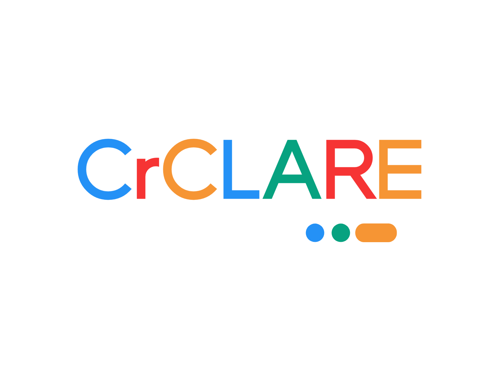

  
  <h1>CrCLARE Studio</h1>
  
<strong>A single spark can start a prairie fire.</strong>

  
<em>Here We Go.</em>

  &emsp;
  &emsp;
  

  <a href="./README.md">English</a> | <a href="./README.zh.md">简体中文</a>

---

## 📁 About This Repository

This repository (`.github`) serves two purposes for **CrCLARE Studio**:

1. **Organization Profile**: Hosts the `profile/README.md` shown on our organization's homepage.
2. **Website Hosting**: Hosts the static source code for our official website (`crclare.top`), deployed directly via **GitHub Pages**.

## 📂 What's Inside

- `profile/README(.zh).md` — The organization profile you are reading now.
- `index.html` — The homepage.
- `privacy.html` — Privacy Policy.
- `cookies.html` — Cookie Policy.
- `copyright.html` — Copyright & Licensing.
- `reward.html` — Sponsorship page.
- `logo.png`, `avatar.png` — Static assets.

## 🔗 Quick Links

- **Website**: [https://crclare.top](https://crclare.top)
- **Documentation**: [https://docs.crclare.top](https://docs.crclare.top)
- **System Status**: [https://status.crclare.top](https://status.crclare.top)
- **Main Project (Chronos Seal)**: [https://github.com/CrCLARE/Chronos-Seal](https://github.com/CrCLARE/Chronos-Seal)

---

  Create Wonderful Code, Build A Wonderful World.

